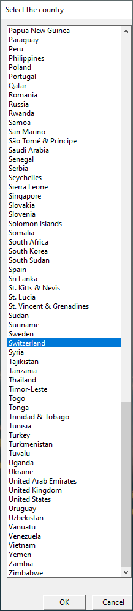
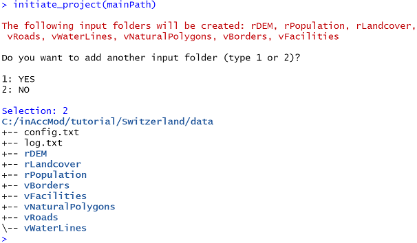
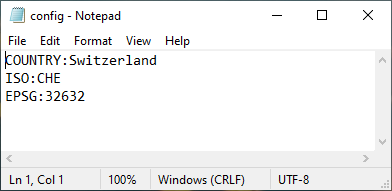
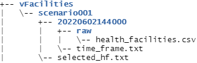
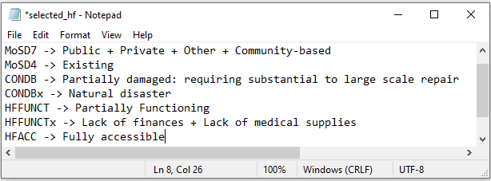
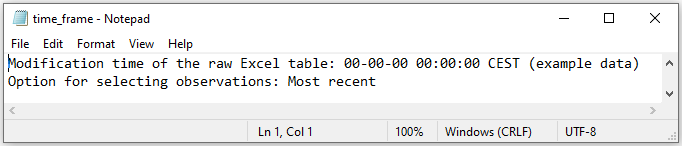
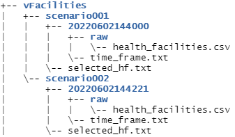
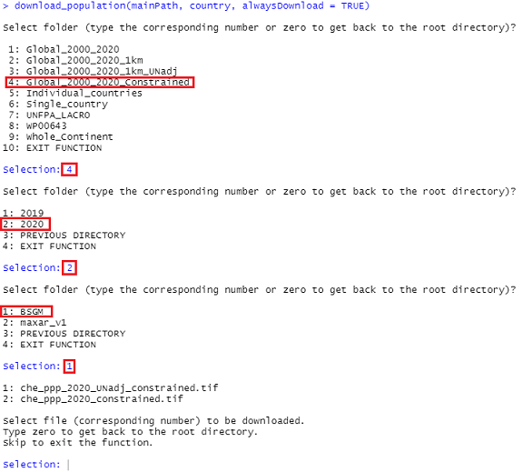
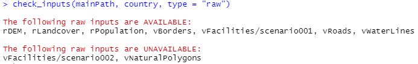
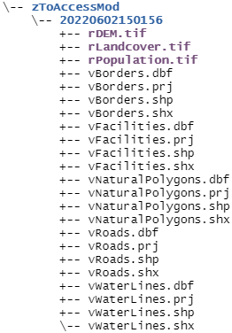

```{r, include = FALSE}
knitr::opts_chunk$set(
  collapse = TRUE,
  comment = "#>"
)
```

```{r setup}
library(inAccessMod)
```

### Description
This package allows us to easily prepare all the required layers for AccessMod. A proper folder structure is created in order to manage multi-temporal data and/or multiple HeRAMS analysis scenarios. While the functions to process health facility tables are specifically designed to handle HeRAMS data, the other ones can be used for any other project. The downloading, cropping, masking, resampling and exporting processes are automated to a large degree, making the preparation of the inputs quick and straightforward.

### Installation
First, we make sure that the devtools package installed on our computer.
```{r devtools, eval=FALSE}
if (!require("devtools")) install.packages("devtools")
```

Then we use its *install_github* function to download and install the **inAccessMod** package from its github repository.

```{r install, eval=FALSE}
devtools::install_github("ptimoner/inAccessMod")
```

Once it is installed, we can load the package in order to make its functions directly available.

```{r library, message=FALSE}
library(inAccessMod)
```

### Initiate Project
With the *initiate_project* function, we can select the country and automatically, the ISO 3166-1 alpha-3 country code is stored in a config.txt file and the directory main structure for the project is created. This function also creates a log.txt file that will record and track the main operations related to the project. We will see that the final structure arises when downloading and processing the data with the corresponding functions, and it allows multiple ’raw’ inputs and multiple ’processed’ outputs for each input. This can be useful when performing different analyses for the same country (e.g. when we have updated data) or using different processing parameters. To initiate the project, the only parameter we need to provide is the path where the project, namely the country folder will be created.

```{r initiate, eval=FALSE}
mainPath <- "C:/inAccMod/tutorial"
initiate_project(mainPath)
```



As indicated in the console, some input folders are created by default. We are asked if we want to add another input folder. Let's say that it is not necessary. This is how the new directories look like in a tree-like format. Further, we will see how this tree can grow with the downloading and the processing of inputs.



### Import inputs

There is a set of functions that allows to download all the required layers from open database. However, if we would like to use other input data, we can run the copy_input function which only requires the project root path, the country name, and the path of the file or the folder that we would like to import. Then we are interactively asked to select to which input correspond this file or folder. To avoid possible further conflicts, the input has to be a "raw" input (i.e. not projected).

### Download the country boundaries

Now, that the project is initiated, we can download the country boundary layer with the *download_boundaries* function. This layer will help to set the projected coordinate reference system and will be used for cropping, masking and clipping the other input layers. The function requires the name of the country folder, the boundary administrative level and a logical parameter (TRUE/FALSE) that indicates if the layer should always be downloaded, even if it has already been downloaded. If FALSE and if the administrative boundary shapefile has already been downloaded we are interactively asked whether we want to download it again or not. The layer is downloaded from the *geoboundaries* database. If the the administrative level is not available, the function tries a lower one and so on. Metadata file is also downloaded.

```{r boundaries, eval=FALSE}
country <- "Switzerland"
download_boundaries(mainPath, country, adminLevel = 4, alwaysDownload = TRUE)
```

### Set the projected coordinate reference system

Now, we will set the projected coordinate reference system with the *set_projection* function. The "best-fit" and the suitable projected coordinate reference systems are obtained with the *suggest_top_crs* and the *suggest_crs* functions, respectively, from the **crsuggest** package. Both functions work by analyzing the extent of the spatial layer and comparing it to the area extents in the EPSG's coordinate reference system database. By setting *bestCRS* = TRUE, the reference system is set based on the "best-fit" system? If FALSE, we are interactively asked to select the projected coordinate reference system from a list of the suitable reference systems. It has to be noted that the reference system is set for the entire project. If it is modified after having processed some input layers, we have to make sure to process these inputs again. The logical parameter *mostRecent* indicates if it is the most recent boundary shapefile that should be used (in case there were multiple ones). If FALSE and if there are multiple available inputs, we are interactively asked to select the input based on download time. Finally, the logical parameter *alwaysSet* indicates whether the projected coordinate reference system should always be set, even it it has already been set. If FALSE and if the projected coordinate reference system has already been set we are interactively asked whether we want to set it again or not.

```{r set_projection, eval=FALSE}
set_projection(mainPath, country, mostRecent = TRUE, alwaysSet = TRUE, bestCRS = TRUE)
```

Let's have a look at the project config.txt file. It is used to retrieve the project parameters in other functions and should not be modified manually.



The function also has projected the boundary shapefile and we can observe how the directory structure has changed. The sub-folder names refer to the time (year, month, day, hour, minute, second, all together) at which the input was downloaded or the process was run. In the following example, we observe that the raw boundary shapefile was downloaded at 2022-05-27 14:09:56 and was processed at 2022-05-27 14:11:02.


### Filter the health facilities and create a point shapefile (HeRAMS table)

This section is only compatible with the HeRAMS tables. If we are not working with HeRAMS data, we can just skip this part and use the *copy_input* function to copy a health facility shapefile into an appropriate sub-folder (it will copy the input to e.g. /vFacilities/20220524103021/raw).

Now, let's say that we are dealing with HeRAMS data and let's filter the health facilities from our raw health facility tables with the *filter_hf* function, and create a point shapefile of the filtered facilities with the *create_hf_facilities* function. We need two tables, the one with the responses as text (e.g. "Available"), and the one with responses as codes (e.g. "A1")  

The function *filter_hf* requires the main project folder and the country folder name. Besides, it also requires the paths to the raw text and code tables (if NULL, we are asked whether we want to take fictitious example data from Switzerland). We have fourteen other parameters: scenario, mostRecentObs, defaultParamaters, type, ownership, status, building, equipment, functionality, accessibility, support, services, partners and barriers.

To understand these parameters, let's see how this function works.

#### scenario
We are interactively asked to select the health facilities that we want to keep based on available attribute values. After a first filter on main information (e.g. health facility type) and operationality (e.g. status, building condition, functionality, etc.), we are asked whether we would like to focus on specific health services. The overall information regarding the analysis scenario is recorded in a text file (selected_hf.txt) which should not be modified manually. A new scenario folder is created for any new set of selection criteria. The first time this function is run, a first scenario folder is created. The next times, we have two options: 1) We leave the scenario parameter NULL; we will be then interactively asked to select the health facility based on specific attributes, and if the selection criteria are identical than in any previous run, the corresponding scenario folder will be used as output folder. If not, a new scenario will be created. 2) We specify an already created scenario folder, and the function will apply the selection criteria linked with this scenario. Values for the scenario argument can be for instance "001" that corresponds to the folder vFacilities/001 if we would like to use the scenario 1 for filtering.

#### mostRecentObs
HeRAMS data table may include multiple responses for the same health facility and this parameter will define which response is going to be taken into account. If *mostRecentObs* is TRUE, all the most recent observation for each facility will be considered. If FALSE or NULL, we are interactively asked to choose between the following options: "Most recent", "Date limit" or "Case by case". If we select the option 2, we have to specify a date. In option 2, the algorithm removes the observation above the date limit, and takes the most recent one if there still are more than one observation. The selected option is recorded in a text file (time_frame.txt) which should not be modified manually.

#### defaultParameters
This logical parameter allows us to modify the pre-defined code values for the filtering process (column codes, impairment values, partnership values, etc.). When is set TRUE, we can see what are the default values and modify them.

#### type, ownership, status, building, equipment, functionality, accessibility, support
These logical parameters indicate whether the filtering process has to take into account the different health facility variables.

#### services
It is a logical parameter that indicate whether we would like to focus on specific health services

#### Partners
It is a logical parameter that indicate whether we would like to focus on specific support partners (ignored if support = FALSE)

#### Barriers
This logical parameter indicates whether we would like to also filter the health facilities on the causes of possible impairment such as dysfunctionality, unavailable services usually provided, etc. when impaired facilities are selected.

Let's see an example with the fictitious example data. The following command shows the the six first rows of the table and some of the main variables.

```{r fictitious}
inAccessMod::fictitious_herams_data_txt[1:6, c("last_synced", "subject_id", "date", "MoSD4", "CONDB", "HFFUNCT", "HFACC", "MoSDGPS_SQ001", "MoSDGPS_SQ002")]
```


```{r filter_hf, eval=FALSE}
filter_hf(mainPath, country, pathTable = NULL, barriers = FALSE, mostRecentObs = TRUE)
```

A folder "scenario001" was created in which we find the text file called "selected_hf.txt" with the selection criteria and a sub-folder whose name refers to the time at which the table was filtered. In this sub-folder, there is another text file called "time_frame.txt" informing about how the multiple responses per facility were handled, and a "raw" sub-folder that contains the filtered table.







Let's say that we would like to re-run the function with different selection criteria.

```{r filter_hf2, eval=FALSE}
filter_hf(mainPath, country, pathTable = NULL, scenario = NULL, mostRecentObs = TRUE)
```



We can see that we have now two scenario sub-folders. Running again this function with the same criteria used in "scenario001" would create a new sub-folder within "scenario001" and a new time_frame.txt file. 

Now let's create a shapefile from the first health facility filtered table. The function checks if there are missing coordinates and if the facilities fall within the country boundary. If so, we are asked whether we want to add/correct them or remove the corresponding facilities. The *mostRecentBoundaries* parameter indicates if the most recent downloaded boundaries has to be used. If FALSE and if there are multiple available boundary shapefiles, we are interactively asked to select the input based on file creation time. If *rmNA* and *rmOut* are TRUE, the function removes the facilities that have missing coordinates or that fall outside the country boundaries and create text files informing about the removed facilities. Finally the *lonlat* indicates if the coordinates reflect the WGS84 longitude and latitude. If FALSE, an *epsg* code is requires. Finally, the *scenario* parameter allows us to directly specify the sub-project from which we want to vectorize the health facilities. If NULL, we are interactively asked to choose the sub-project from the available ones (during this process we have the option of printing each sub-project selection criteria in the console).

```{r create_hf_shp, eval=FALSE}
create_hf_shapefile(mainPath, country, mostRecentBoundaries = TRUE, lonlat = TRUE, rmNA = TRUE, rmOut = TRUE, scenario = "001")
```

### Download open source layers

#### DEM

This function allows us to download a SRTM 90m resolution (3 arc-seconds) DEM for the entire country and copies it to its corresponding folder. The SRTM tiles to be downloaded are selected based on the extent of the boundary shapefile. If there are multiple tiles, a mosaic is produced. If *alwaysDownload* is TRUE, the raster will always be downloaded, even if it has already been downloaded? If FALSE and if the raster has already been downloaded we are interactively asked whether we want to download it again or not. And the *mostRecent* logical parameter indicates if the most recent boundary shapefile should be selected to define the required DEM tiles?

```{r DEM, eval=FALSE}
download_dem(mainPath, country, alwaysDownload = TRUE, mostRecent = TRUE)
```

#### Population raster

This function allows us to download a population raster from the World Pop FTP and copy it to its corresponding folder. It allows to interactively navigate through the folders and select the population raster to be downloaded. The ISO code retrieved internally is used to match the country FTP folder when available. If *alwaysDownload* is TRUE, the raster is always be downloaded, even if it has already been downloaded? If FALSE and if the raster has already been downloaded we are interactively asked whether we want to download it again or not.

```{r pop, eval=FALSE}
download_population(mainPath, country, alwaysDownload = TRUE)
```



#### Landcover

This function allows us to download the Land Cover 100 m from the Copernicus Global Land Service and copy it to its corresponding folder. The function downloads the landcover tiles from the AWS cloud and determines the file names based on the extent of the boundary shapefile. If there are multiple tiles, it produces a mosaic. If *alwaysDownload* is TRUE, the raster is always be downloaded, even if it has already been downloaded? If FALSE and if the raster has already been downloaded we are interactively asked whether we want to download it again or not. And the *mostRecent* logical parameter indicates if the most recent boundary shapefile should be selected to define the required landcover tiles? 

```{r landcover, eval=FALSE}
download_landcover(mainPath, country, alwaysDownload = TRUE, mostRecent = TRUE)
```

#### Open Street Maps

This function allows us to download the Open Street Map shapefiles corresponding to 'roads', 'rivers' or any other natural feature and copy them to their corresponding folders. The parameter *x* represents the target layer. Can be 'roads', 'waterLines' or 'naturalPolygons'. The logical parameter countryName indicates if the country name should be used to match with the osm.pbf file in the OSM server? If FALSE, it is the extent of the boundary shapefile that is matched with the osm.pbf file in the Geofabrik's free download server. Matching by name is usually much faster and *countryName* should be always set TRUE, unless the country name is complex and not recognized by the server. The *mostRecent* parameter is ignored if *countryName* is TRUE. If x = "roads" and defaultClasses is TRUE, only the official OSM road classes are kept. For waterLines and naturalPolygons, default classes are river and water, respectively. If defaultClasses is FALSE, we can select the available classes we would like to keep.

```{r roads, eval=FALSE}
download_osm(x = "roads", mainPath, country, alwaysDownload = FALSE, countryName = TRUE, mostRecent = NULL, defaultClasses = TRUE)
```

```{r waterLines, eval=FALSE}
download_osm("waterLines", mainPath, country, alwaysDownload = TRUE, countryName = TRUE, mostRecent = NULL, defaultClasses = FALSE)
```

As for the other OSM layers, we are asked which categories we want to keep.


At any time, we can check which inputs (either 'raw' or 'processed') are available and which are not available.

```{r checkInputs, eval=FALSE}
check_inputs(mainPath, country, type = "raw")
```



Let's download the lakes from OSM before processing the inputs.

```{r naturalPolyg, eval=FALSE}
download_osm("naturalPolygons", mainPath, country, alwaysDownload = TRUE, countryName = TRUE, mostRecent = NULL)
```

### Process layers

The following function allows to process any input layer and copy it to its corresponding folder. A 'processed' boundary shapefile is required for processing any other inputs. A 'processed' population raster is required for processing any other raster. These conditions are taken into account and the processing of these layers is performed even if they are not selected and if 'processed' layers are not available. These are the specific parameters:

* *selectedInputs* character; vector indicating the inputs to be processed. Raw inputs must be available. Argument can be set to "All" to consider all the available 'raw' inputs. If NULL, the user is interactively asked to select the available inputs to be processed.
* *mostRecent* logical; should the most recent input be selected? If FALSE and if there are multiple available inputs, the user is interactively asked to select the input based on file creation time.
* *alwaysProcess* logical; should always the input be processed? If *alwaysProcess* = FALSE and if the input has already been processed, the user is interactively asked whether they want to process it or not.
* *defaultMethods* logical; should be the default methods be used for projecting and resampling, respectively. For the population raster, these are the 'bilinear' method for projecting and the 'sum' or the 'bilinear' for the resampling,  depending on if the new resolution is lower or higher. For the landcover raster, the 'near' method is used for both the  projection and resampling. For the the DEM, the 'bilinear' method is used for both the projection and resampling. If FALSE, the user is interactively asked to choose the methods from a list of options.
* *changeRes* logical; does the user want to change the raster resolution of the population raster? If NULL, the resolution  is printed and it is interactively asked the user if they want to change it. IF FALSE, there is no resampling.
* *newRes* numeric; new resolution in meters. Ignored if the changeRes is FALSE. If NULL and if *changeRes* is TRUE, the user is interactively asked to provide the new resolution.
* *popCorrection* logical; should the raster correction algorithm be run. If it is NULL, the user is interactively asked whether they want to run it or not.
* *gridRes* numeric; the resolution of the grid shapefile used for correcting the raster. Ignored if *popCorrection* is FALSE. If NULL and popCorrection is TRUE, the user is interactively asked to provide the grid resolution.

```{r process_inputs, eval=FALSE}
process_inputs(mainPath, country, selectedInputs = "All", mostRecent = TRUE, alwaysProcess = TRUE, defaultMethods = TRUE, changeRes = TRUE, newRes = 100, popCorrection = TRUE, gridRes = 3000)
```

Let's have a look at the log.txt file


### Label land cover classes
The *label_landcover* function creates a CSV table with landcover codes and labels that can be imported into AccessMod. Besides the common arguments (mainPath, country, mostRecent) we have the *defaultLabels* logical parameter. It indicates if the Copernicus default labels should be associated with the the landcover raster values. If FALSE, we are interactively asked to enter the label names for each value.

```{r labels, eval=FALSE}
label_landcover(mainPath, country, mostRecent = TRUE, overwrite = TRUE, defaultLabels = TRUE)
```

### Processed input compiling

To facilitate the importation of processed inputs into AccessMod, we can use the *compile_processed_data* function. It compiles the available processed layers and copy them to a new folder called "zToAccessMod". Different runs of this function will create different sub-folder within the "zToAccessMod" folder. 

When *mostRecent* is TRUE, it is the most recent processed layer that is copied into the new folder.

```{r compile, eval=FALSE}
compile_processed_data(mainPath, country, mostRecent = TRUE)
```



### Sub-national travel scenarios
We can use the *multi_ts* function to handle different travel scenarios for different administrative units. It creates an updated merged landcover and an updated travel scenario table. The required inputs are an administrative shapefile, a merged landcover imported from AccessMod, and an Excel (or CSV) table for each travel scenario. The function requires a folder that only contains the required inputs. When running the function, the user is asked to select the attribute table column of the shapefile that refers to each administrative unit, and then to select the travel scenario for each administrative unit.

```{r multi_ts, eval=FALSE}
multi_ts("C:/Test/TravelScenarios/", "adminLayerName", "landcoverFile.tif", zones_ts = NULL)
```

The *zones_ts* argument refers to an Excel or CSV table that relates the administrative units to the different scenarios. Two columns: the first one has the same name than the field name of the administrative layer attribute table that refers to each administrative unit, and the second one called 'scenario'. In the first all the different units (as indicated in the attribute table), in the second, the names (without the extension) of the different scenario tables. If set to NULL, the user is interactively asked to assign a scenario to each administrative unit, and a zones_ts table is created.

### Health facilities that provide the best coverage
The *hf_best_cov* function allows to select the health facilities that offer the best population coverage using their catchments (calculated in AccessMod) and a raster of population. This function also offers the possibility to ensure that N facilities are selected for each administrative unit. The inputs required are the catchment shapefile and the population raster. When we would like to select a minimum number of facilities per administrative unit, we also need the health facility shapefile and the administrative unit shapefile. The outputs are a table with the selected facilities with their names, the population they cover, the cumulative sum of the covered population, and when corresponding, the region they are located in. A bar plot is also generated representing the cumulative sum of the covered population for the selected facilities. The algorithm works recursively. It orders the facility based and the total population located within their catchments, it selects the first facility and removes the population covered in its catchment in case we would have catchments that overlap, to avoid counting the same population multiple times. It repeats the process until the number of facilities to be selected is reached.

Let's say that we would like to select the 10 'best' facilities in terms of coverage regardless the administrative units they belong to. You will need to have all your inputs in one folder.

```{r cov, eval=FALSE}
multi_ts(workDir = "C:/Test/BestCoverage/", catchShp = "catchment", popRaster = "population.tif", catchHfColName = "facilitiyName", nTot = 10)
```

*workDir* is the path of the folder that contains the inputs, *catchShp* is the name of the catchment shapefile WITHOUT extension, *popRaster* is the name of the population raster file WITH extension, *catchHfColName* is the name of the health facility name column in the catchment shapefile, and *nTot* the number of facilities to be selected.

If we would like to select at least one facility per administrative unit:

```{r cov2, eval=FALSE}
multi_ts(workDir = "C:/Test/BestCoverage/", catchShp = "catchment", popRaster = "population.tif", catchHfColName = "facilitiyName", nTot = 10, adminCheck = TRUE, hfShp = "facilities", hfHfColName = "facilityName", npAdmin = 1, adminShp = "adminUnit", adminColName = "regionName")
```

*adminCheck = TRUE* indicates that at least N facilities per administrative unit are selected (by default adminCheck = FALSE), *hfShp* corresponds to the name of the health facility shapefile WITHOUT extension, *hfHfColName* is the name of the health facility name column in the health facility shapefile, *npAdmin* is the the minimum number of health facilities to be selected by administrative unit, *adminShp* is the shapefile of the administrative units WITHOUT extension, and *adminColName* is the name of the administrative unit name column in the administrative unit shapefile.
